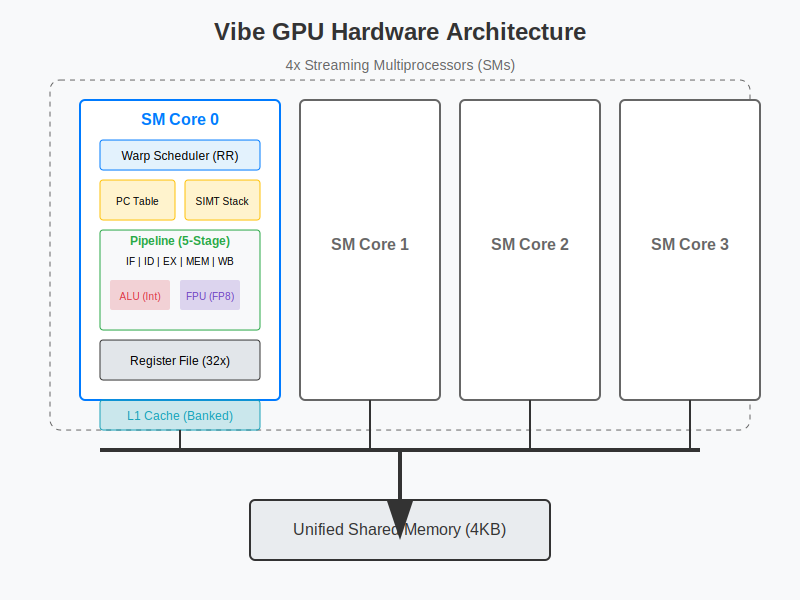
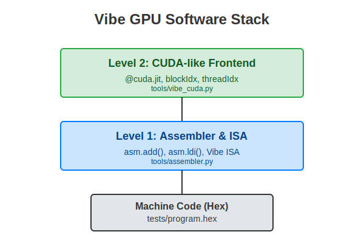

# Vibe GPU 项目

从零实现的自定义 **SIMT（单指令多线程）** GPU，包含 SystemVerilog RTL、基于 Verilator 的仿真环境，以及从汇编到类 CUDA 前端（`tools/vibe_cuda.py`）的完整软件栈。

**[📄 架构说明（中文）](docs/ARCHITECTURE.md)**  
**[📄 指令集 ISA（中文）](docs/isa.md)**  
**[📄 仿真与波形（中文）](docs/仿真与波形.md)**

## 1. 硬件架构（RTL）



GPU 侧重 SIMT 执行、硬件管理分支分歧与流水线设计。流水线、SIMT 栈与存储层次详见 **[docs/ARCHITECTURE.md](docs/ARCHITECTURE.md)**。

* **核心**：4 个流式多处理器（SM）。
* **执行模型**：SIMT。
  * **线程**：每 Warp 8 个线程，每 SM 4 个 Warp（共 128 个线程）。
  * **调度**：轮询 Warp 调度器。
* **流水线**：五级（IF、ID、EX、MEM、WB），含记分板与冒险检测。
* **存储**：统一地址空间、L1 缓存与分体访问。
* **ISA**：32 位类 RISC 指令集，支持 **FP8（E4M3）** 与 **FP4（E2M1）**（`FADD4` / `FMUL4`，使用寄存器**低 4 位**）。

## 2. 软件栈



提供自顶向下的工具链。

### 第二层：Vibe CUDA 前端（`tools/vibe_cuda.py`）

使用 Python 编写内核，风格接近 Numba / PyTorch；编译器进行 AST 分析、寄存器分配与汇编生成。

```python
import tools.vibe_cuda as cuda

@cuda.jit(block_dim=32)
def matmul_kernel(a, b, c):
    gid = cuda.blockIdx.x * cuda.blockDim.x + cuda.threadIdx.x
    # ... 矩阵乘逻辑 ...
    c[gid] = acc
```

### 第一层：汇编器（`tools/assembler.py`）

通过 Python 调用直接生成机器码。

```python
asm.ldi(1, 10)      # R1 = 10
asm.add(3, 1, 2)    # R3 = R1 + R2
```

## 3. 测试与验证

```bash
python tests/test_suite.py
```

**包含的测试**：调试与全局 ID、Load、循环、分支分歧、向量乘、矩阵乘、全连接层、**FP4 E2M1 乘法**（`apps/app_fp4_test.py`）、**Tensor Core `TCDP4` 四路点积**（`apps/app_tensor_test.py`，与 `rtl/tensor_core.sv`、`tools/fp4_soft.dot4_fp4` 对齐）。

仅跑 FP4 / Tensor 并检查内存与波形：

```bash
python tests/test_fp4_only.py
python tests/test_tensor_only.py
```

## 4. 目录结构

* `rtl/`：SystemVerilog（`sm_core.sv`、`alu.sv`、`fp4_unit.sv`、`simt_stack.sv` 等）。
* `sim/`：Verilator 仿真（`main.cpp`、`Makefile`）。
* `tools/`：编译器与汇编器（`vibe_cuda.py`、`assembler.py`、`isa.py`、`fp4_soft.py`）。
* `apps/`：应用内核示例。
* `tests/`：`program.hex`、黄金参考、`test_suite.py`、`test_fp4_only.py`、`test_tensor_only.py`。
* `docs/`：架构与 ISA 文档（中文）。

## 5. 环境准备与运行

1. **依赖**：`verilator`、`make`、`python3`、`g++`（Linux/WSL 或 MSYS2 上最易安装完整链）。
2. **生成程序并仿真**：
   ```bash
   python apps/app_cuda_matmul.py
   cd sim && make run
   ```
3. **波形**：仿真生成 `sim/sim_trace.vcd`，可用 [GTKWave](https://gtkwave.sourceforge.net/) 打开查看流水线、PC、寄存器等信号。

### Windows 提示

* 若已安装 **WSL2（Ubuntu）**：在 WSL 内 `sudo apt install verilator make g++ python3`，在项目目录执行上述命令。
* 仅 Windows 时可用 **MSYS2** 安装 `mingw-w64-x86_64-verilator` 等，或在具备 GNU 工具链的环境中编译 `sim/Makefile`。
