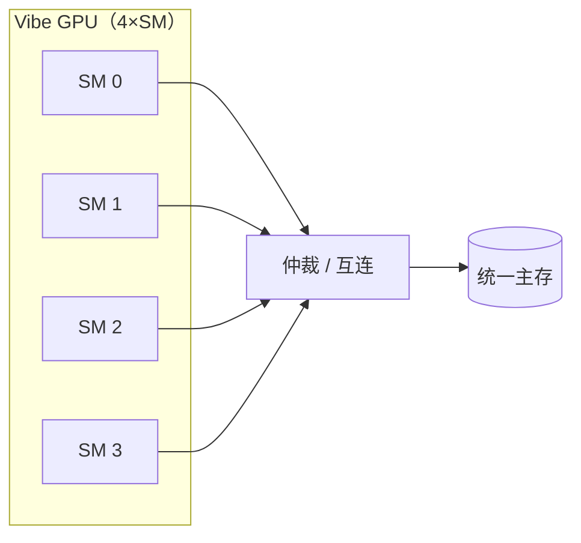
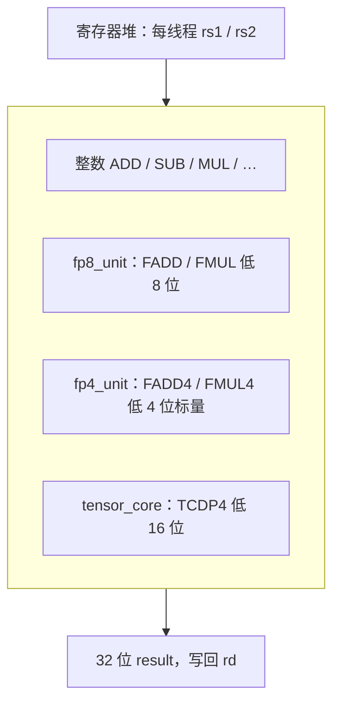
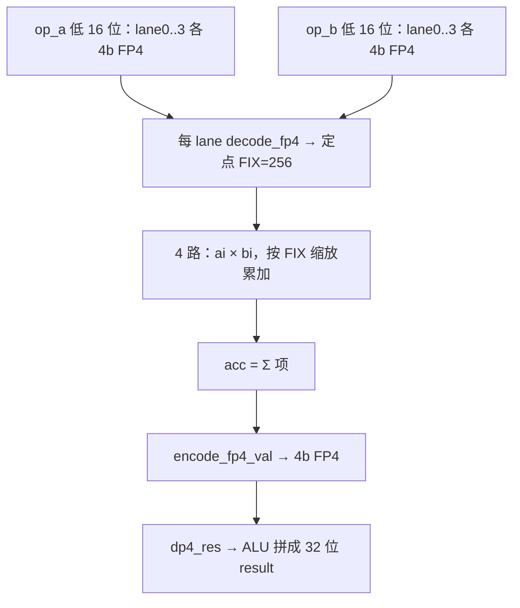
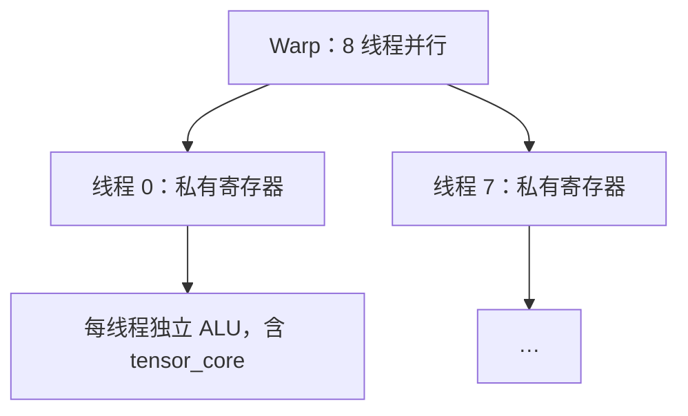
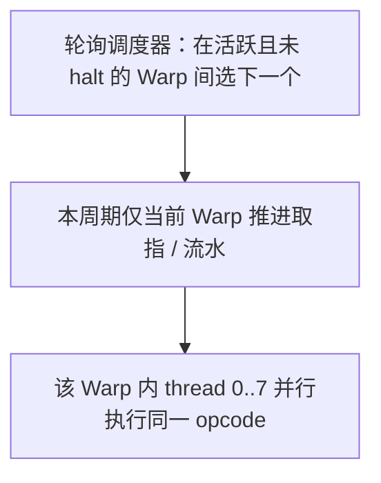
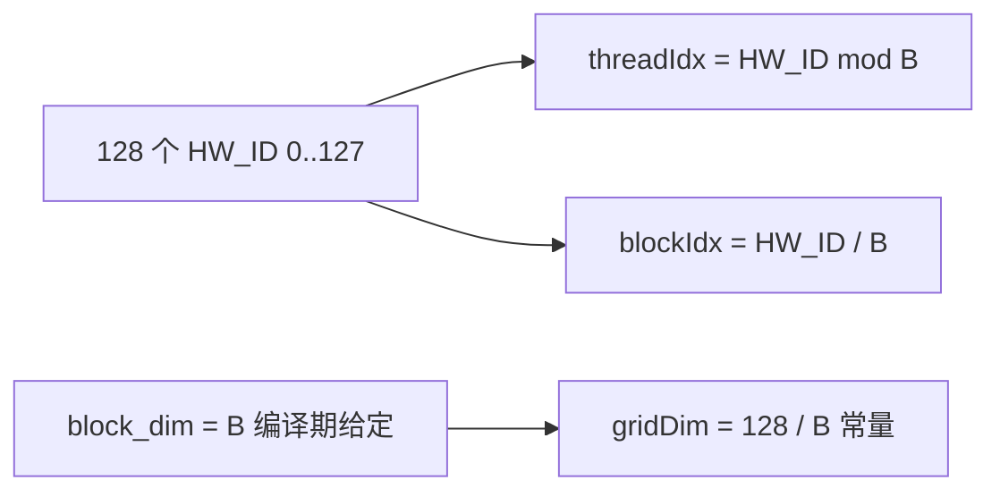

# 系统执行过程与 Tensor Core（图示）

本文用 Mermaid 图描述 Vibe GPU 从系统级到 **TCDP4（Tensor Core 类比）** 的执行过程，与 [ARCHITECTURE.md](ARCHITECTURE.md)、`rtl/sm_core.sv`、`rtl/alu.sv`、`rtl/tensor_core.sv` 一致。在 GitHub/GitLab 或支持 Mermaid 的 Markdown 预览中可直接渲染。

---

## 1. 系统级：多 SM、共享主存

---

## 2. 单条指令在 SM 内的流水线

说明：

- **IF**：Warp 轮询调度，从 PC 取指。  
- **ID**：译码、记分板 RAW、读 `rs1`/`rs2`。  
- **EX**：ALU / FP8 / FP4 标量 / **TCDP4**、SIMT 栈。  
- **MEM**：`LDW`/`STW` 与 L1；未命中时可停顿整条流水线。  
- **WB**：写回 `rd`，清除记分板。

---

## 3. EX 阶段：数据通路分流（含 Tensor Core）

| 路径 | 类比 | 指令 | 数据 |
|------|------|------|------|
| `fp8_unit` | 通用 FP | FADD / FMUL | 每线程 `op_a` / `op_b` **低 8 位** |
| `fp4_unit` | CUDA Core 类标量 | FADD4 / FMUL4 | **低 4 位** 一对 FP4 |
| `tensor_core` | Tensor Core 类规约 | TCDP4 | **低 16 位** = 4×FP4 与 4×FP4 做点积 |

---

## 4. Tensor Core（`TCDP4`）内部执行过程

语义：对 `rs1`、`rs2` 的**低 16 位**各拆成 4 个 FP4 lane，做点积 \(\sum_{i=0}^{3} a_i b_i\)，再量化为一个 FP4 写入 `rd`（结果在 32 位字中占**低 4 位**）。

---

## 5. Warp / 线程视角（SIMT）

同一条 `TCDP4` 在 **8 个线程上各执行一次**，每条线程使用自己的 `rs1`/`rs2` 低 16 位；这是 **SIMT**，不是一条指令在多条线程间共享同一组寄存器。

---

## 6. Warp 分配与线程分配

本节的「分配」指 **硬件固定拓扑** 与 **运行时调度**，不是操作系统式的动态创建线程。

### 6.1 固定拓扑（每个 SM）

| 层级 | 数量 | 编号 | 说明 |
|------|------|------|------|
| SM | 全芯片 **4** 个 | `sm_id`：0～3 | `gpu_top` 例化 4 个 `sm_core`，`sm_id` 端口硬连线 |
| Warp / SM | **4** | `warp_id`：0～3 | 每 SM 独立维护 `pc_table[0..3]`、`exec_mask_table[0..3]` 等 |
| 线程 / Warp | **8** | `thread_id`：0～7 | `THREADS_PER_WARP=8`，与 `alu` 的 `thread_id`（3 位）一致 |
| 寄存器 / 线程 | **32** 个 32 位 | `R0`～`R31` | `regfile` 存储为 `regs[warp][thread][reg]` |

全 GPU 上 **逻辑线程总数**：\(4 \times 4 \times 8 = 128\)。每个 **(SM, Warp, Thread)** 三元组在结构上唯一，仿真里也没有再拆成更细的「动态分配块」。

### 6.2 寄存器与线程的对应关系

寄存器堆按 **Warp → 线程 → 寄存器号** 三维索引（见 `rtl/regfile.sv`）：同一 Warp 内 8 条线程 **各自一套** `R1`～`R31`（`R0` 恒 0）。**不存在**「多个 Warp 共享同一组线程寄存器」——换 Warp 就是换 `r_warp_id` / `w_warp_id`，读写的 bank 整体切换。

### 6.3 Warp 调度（分配时间片）

- 每个周期，**至多一个 Warp** 在取指级被选中（当前 `current_fetch_warp`）。
- 选中规则：**轮询**：从 `current_fetch_warp` 的下一个开始，找第一个 **活跃且未 halt** 的 Warp；若停顿/冒险不推进取指，则保持调度语义与流水线一致（见 `sm_core.sv` 中 `next_fetch_warp` 组合逻辑）。
- 因此 **Warp 之间是分时复用** 该 SM 的流水线；**同一 Warp 内 8 条线程**对当前指令是 **同一周期并行执行**（8 个 `alu` 实例，`thread_id` 固定为 0～7）。

### 6.4 全局硬件线程 ID（软件约定）

类 CUDA 前端在需要 **跨 SM 区分线程** 时，使用与 `tools/vibe_cuda.py` 中 `emit_hw_id` 一致的公式：

\[\text{HW\_ID} = \text{SMID} \times 32 + \text{WARPID} \times 8 + \text{TID}\]

- **TID**：`TID` 指令，值为当前线程在 Warp 内下标 0～7。  
- **WARPID**：`WARPID` 指令，当前 Warp 号 0～3。  
- **SMID**：`SMID` 指令，当前 SM 号 0～3。  

该 ID 把 128 个 **(SM, Warp, Thread)** 映射到 **0～127** 的线性编号，便于标量内核里算全局下标、访存偏移等。**硬件并不自动替你算 HW_ID**，而是由程序用上述指令组合实现（与手写汇编时自行 `tid`/`warpid`/`smid` 等价）。

### 6.5 与真实 GPU 的差异（简要）

- **无** GigaThread 级「把 Block 分配到 SM」的独立硬件调度器：物理上仍是 **多 SM + 多 Warp + 线程** 执行同一份内核（见 §7）。  
- **Grid / Block** 在 Vibe CUDA 前端里是 **从 HW_ID 推导的 1D 逻辑划分**，不是运行时向硬件「申请块」。

更细的流水线与 SIMT 栈见 [ARCHITECTURE.md](ARCHITECTURE.md) §1.2～§1.3。**Grid / Block 与 `HW_ID` 的对应关系**见下文 §7。

---

## 7. Grid 与 Block 的「分配」过程（Vibe CUDA）

本节说明 **`tools/vibe_cuda.py`** 如何把类 CUDA 的 `blockDim` / `blockIdx` / `threadIdx` / `gridDim` 映射到 **128 个硬件线程**。这里 **没有** CUDA 驱动里的「按 Block 向 SM 派发」步骤，只有 **编译期** 的位运算与常量展开。

### 7.1 前提：硬件线程总数固定

- 全芯片 **128** 条逻辑线程（`HW_ID` ∈ 0～127），与 §6.1 一致。  
- 内核启动时 **不** 传入 `gridDim`：前端假定 **恰好占满这 128 个线程**（仿真里同一份 `program.hex` 在各 SM 上执行）。

### 7.2 编译期参数：`block_dim`

- 通过 **`@cuda.jit(..., block_dim=B)`**（或 `jit(..., block_dim=B)`）指定 **每个 Block 的线程数** `B`。  
- 约束：**`B` 必须为 2 的幂**（`CudaCompiler` 用 `log2(B)` 做移位，见 `vibe_cuda.py`）。  
- **`cuda.blockDim.x`** 编译为加载常量 **`B`**。

### 7.3 从 `HW_ID` 推导 `threadIdx` 与 `blockIdx`（1D 线性 Grid）

编译器先 **`emit_hw_id`** 得到 `HW_ID`，再：

| 表达式 | 实现思路 | 含义 |
|--------|----------|------|
| **`cuda.threadIdx.x`** | `HW_ID & (B - 1)` | 块内线程下标，等价于 **`HW_ID mod B`** |
| **`cuda.blockIdx.x`** | `HW_ID >> log2(B)` | 块号，等价于 **`⌊HW_ID / B⌋`**（1D Grid） |
| **`cuda.gridDim.x`** | 常量 **`128 // B`** | 块总数；代码里 **`total_threads` 写死为 128** |

因此 **Grid 维度由 `B` 唯一确定**：  
\[\text{gridDim.x} = \frac{128}{B}\]  
且 **每个 Block 恰好 `B` 个线程**，总共 **`gridDim.x × B = 128`** 个线程与硬件一一对应。

示例（与仓库示例一致）：

- **`B = 32`**：`gridDim.x = 4`，`blockIdx` ∈ {0,1,2,3}，每块 32 个 `threadIdx`。  
- **`B = 8`**：`gridDim.x = 16`，块更细、每块仅 8 个线程。

### 7.4 「分配」在做什么、不做什么

**实际发生的事：**

1. **物理上**：每条硬件线程已有固定的 `(SMID, WARPID, TID)`，调度器按 §6.3 轮询 Warp，**没有**「把某 Block 指到某 SM」的额外一步。  
2. **逻辑上**：若内核里访问 `blockIdx` / `threadIdx`，编译器只是在 **该线程的 `HW_ID` 上** 做 **与 / 移位**，得到 **块号** 和 **块内线程号**，用于用户写的寻址或分支。

**没有发生的事：**

- 没有 **CUDA Runtime 的 `<<<grid, block>>>`** 那种 **运行时** 队列与 SM 映射。  
- 没有 **2D/3D** `blockIdx.y` / `gridDim.y` 等（当前前端仅展开 **`*.x`**）。  
- **`cuda.grid()`** 在 AST 里直接 **`emit_hw_id`**，等价于线性 `HW_ID`，不是「网格坐标」。

### 7.5 与 NVIDIA 模型的对照（便于理解）

| CUDA 概念 | Vibe GPU 中的位置 |
|-----------|-------------------|
| 线程 | 硬件 `(SMID, WARPID, TID)` → `HW_ID` |
| Block | **`HW_ID` 按 `B` 划分** 的连续区间，**非**单独分配的实体 |
| Grid | **隐式 1D**，长度 **`128/B`**，由 `block_dim` 决定 |
| Block → SM | **无**显式映射；各 SM 上的线程各自带自己的 `HW_ID`，自然落在某一 `blockIdx` 区间 |

---

更细的软件栈说明见 [ARCHITECTURE.md](ARCHITECTURE.md) §2。
